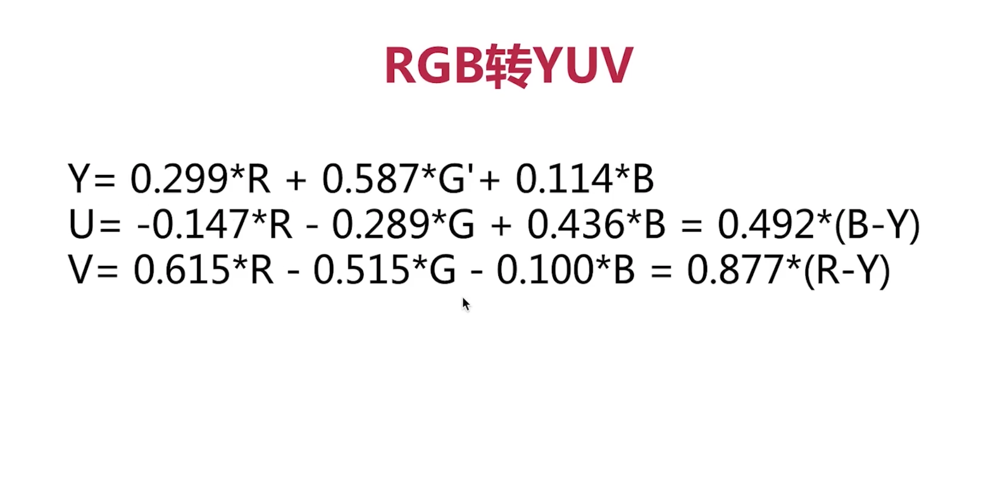
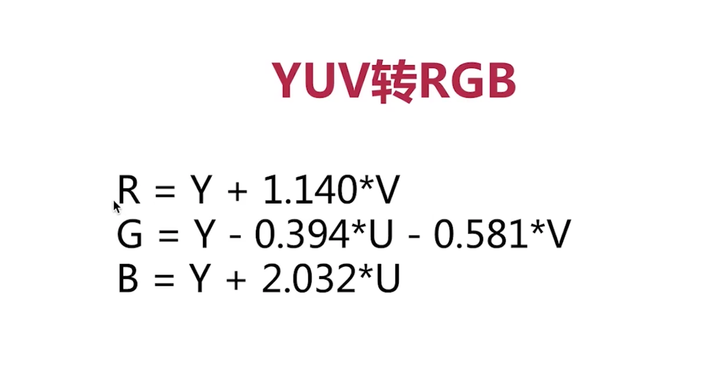
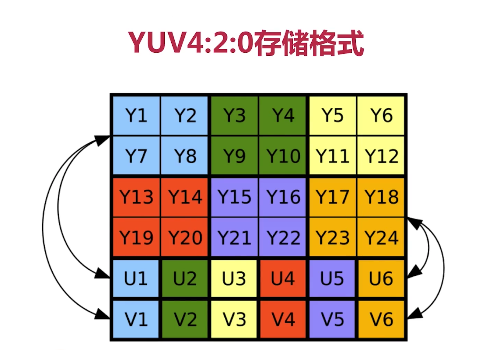
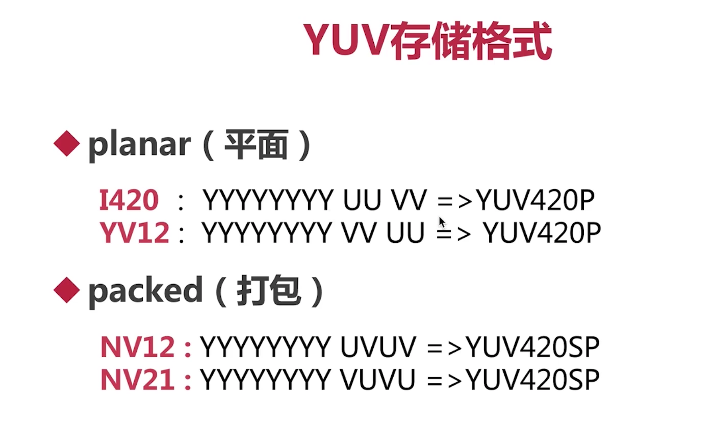

## 一、视频基础知识

### 1、RGB888和RGBA分别占多少字节？

- RGB888 占 3个字节（24bit）
- RGBA 占 4个字节（32bit）


### 2、RGB 和 BGR 是什么？

- RGB 与 BGR 都是颜色格式，只是存储是R与B的位置不同。
- BMP 使用的是BGR格式。


### 3、PPI是什么？DPI是什么？

- PPI：Pixels per inch，每英寸展示的像素数
- DPI：Dots per inch，每英寸展示的点数
- <font color="red">PPI > 300 就属于视网膜级别</font>
- <font color="red">基本上PPI就等于DPI</font>


### 4、什么是分辨率？

- X轴的像素个数  * Y轴的像素个数
- 常见的宽高比 16:9  、 4:3
- 360P/720/1K/2K


### 5、什么是帧率？

- 每秒钟采集/播放图像的个数
- 动画的帧率是 25 帧/s
- 常见的帧率是: 15帧/s，30帧/s，60帧/s

- <font color="red">分辨率决定视频的清晰度，帧率决定视频的流畅度。</font>


### 6、帧率25的720p视频，RGB码流是多少？

- 25 * 720 *1280 * 3 * 8 = 552.96Mbps


### 7、图像大小与显示区域大小有哪三种关系？（解决方案？）

- 图像等于显示区域，刚好展示。
- 图像小于显示区域，拉伸/留白。
- 图像大于显示区域，缩小/裁剪。


## 一、YUV

### 1、YUV中的Y是什么？UV是什么？

- Y：表示明亮度。
- UV：是描述影像色彩饱和度。
- 主要的采样格式有YUV420、YUV422、YUV444


### 2、RGB与YUV的关系是什么？

- RGB和YUV都是颜色的存储方案，但是适用场景不相同

- RGB：用于屏幕图像的展示
- YUV：用于采集与编码





### 3、为什么要采用YUV这种颜色格式？

- ①视频的发展历史是从黑白视频到彩色视频，这是历史原因的部分

- ②YUV由于人跟对Y分量敏感，对UV分量不敏感，所以YUV易于压缩。这是技术上的优势


### 4、YUV420p存储格式示意图








### 5、我们口头上常说的1兆带宽，是什么含义？

- 这里的说的是1兆比特位，并非字节数
- 比如1兆的带宽，理论下载速度是 125KB/s
- 所以我们计算码流大小的时候，通常也是用比特位来计算，也就是 <font color="red">比特位 = 字节数 * 8</font>


## 三、提取/录制YUV数据

### 1、如何从MP4中，提取YUV数据？

- 提取数据

```sh
ffmpeg -i raw.mp4 -an -c:v rawvideo -pix_fmt yuv420p yuv420p.yuv
```

- 播放yuv

```sh
ffplay -video_size 864x486 -pixel_format yuv420p -framerate 25 yuv420p.yuv
```

- 如果格式错误，会产生很有趣的现象，比如改成<font color="red">nv12</font>格式，会产生绿屏效果；如果尺寸错误，就会出现以前电视机的满屏马赛克，或者屏幕上或下移动的效果。

```sh
ffplay -video_size 864x486 -pixel_format nv12 yuv420p.yuv
```


### 2、如何从MP4中，提取分别提取Y、U、V数据？

- 单独提取

```sh
ffmpeg -i raw.mp4 -filter_complex 'extractplanes=y+u+v[y][u][v]' -map '[y]' y.yuv -map '[u]' u.yuv -map '[v]' v.yuv
```

- 单独播放Y数据

```sh
ffplay -video_size 864x486 -pixel_format gray y.yuv
```


### 3、代码录制YUV数据（和音频录制几乎一模一样）

```C
#include "test.h"
#include <unistd.h>
#include "include/libavdevice/avdevice.h"

//录视频
void record_video(void) {
    int ret = 0;
    char errors[1024];
    
    //ctx
    AVFormatContext *fmt_ctx = NULL;
    AVDictionary *options = NULL;
    
    //packet
    int count = 0;
    AVPacket pkt;
    
    // [video device]:[aduio device]
    char *devicename = "0";
    
    //register audio device
    avdevice_register_all();
    
    //get format
    const AVInputFormat *iformat = av_find_input_format("avfoundation");
    
    av_dict_set(&options, "video_size", "640x480", 0);
    av_dict_set(&options, "framerate", "30", 0);
    av_dict_set(&options, "pixel_format", "nv12", 0);
    
    //open device
    ret = avformat_open_input(&fmt_ctx, devicename, iformat, &options);
    if (ret < 0) {
        av_strerror(ret, errors, 1024);
        printf("avformat_open_input error");
        return;
    }
    
    //crate file
    char *outPath = "/Users/carrot/Desktop/MyCode/nv12.yuv";
    FILE *outFile = fopen(outPath, "wb+");
    if (outFile == NULL) {
        printf("outFile fopen failed");
        return;
    }
    
    //read data from device
    while ((ret = av_read_frame(fmt_ctx, &pkt)) == 0 || count++ < 20000) {
        usleep(100);
        printf("ret %d", ret);
        if (pkt.size > 0) {
            // (宽 * 高) * （yuv420=1.5 或 yuv422=2 或 yuv444=3）；nv12属于yuv420
            // 640*480*1.5 = 460800
            fwrite(pkt.data, 460800, 1, outFile);
            fflush(outFile);
            printf("packet size is %d(%p), count=%d \n", pkt.size, pkt.data, count);
            av_packet_unref(&pkt);
        }
    }
    
    //close device and release ctx
    avformat_close_input(&fmt_ctx);
    
    printf("运行结束\n");
}
```

- 播放刚刚录制的视频

```sh
ffplay -video_size 640x480 -pixel_format nv12 nv12.yuv
```

