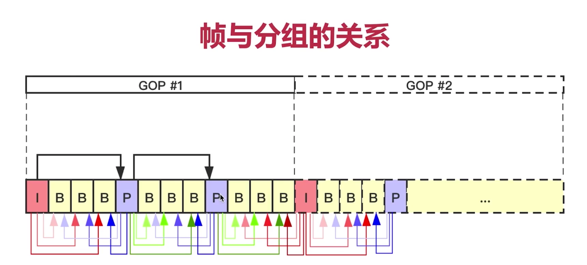
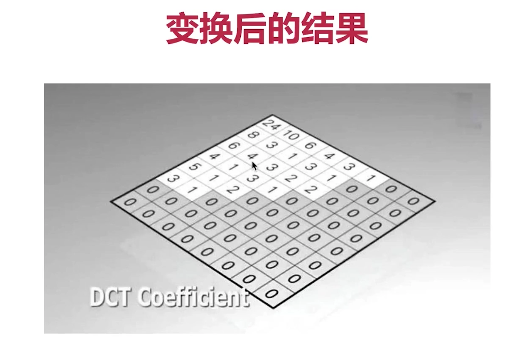
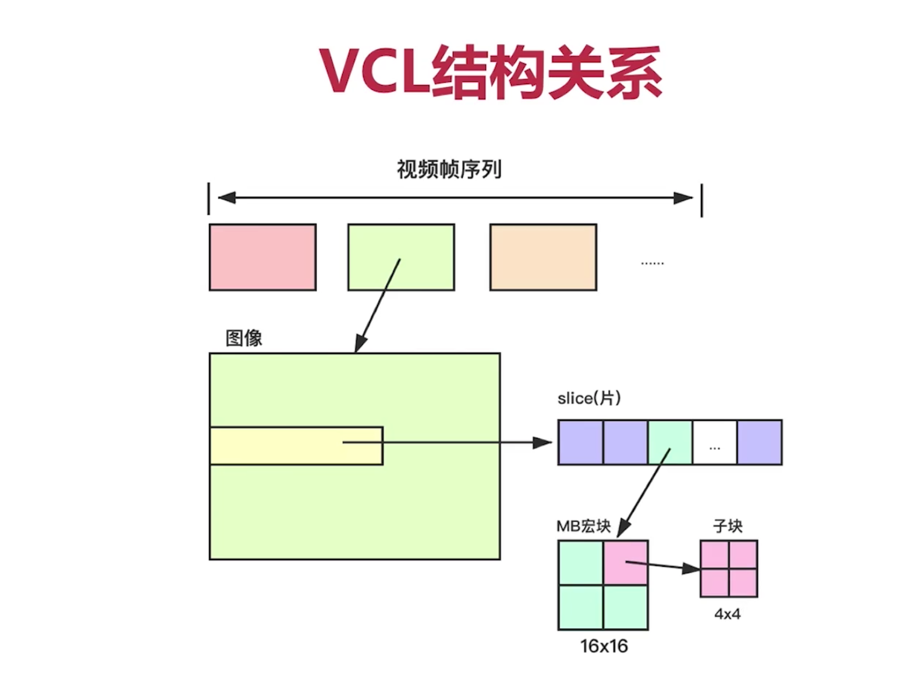
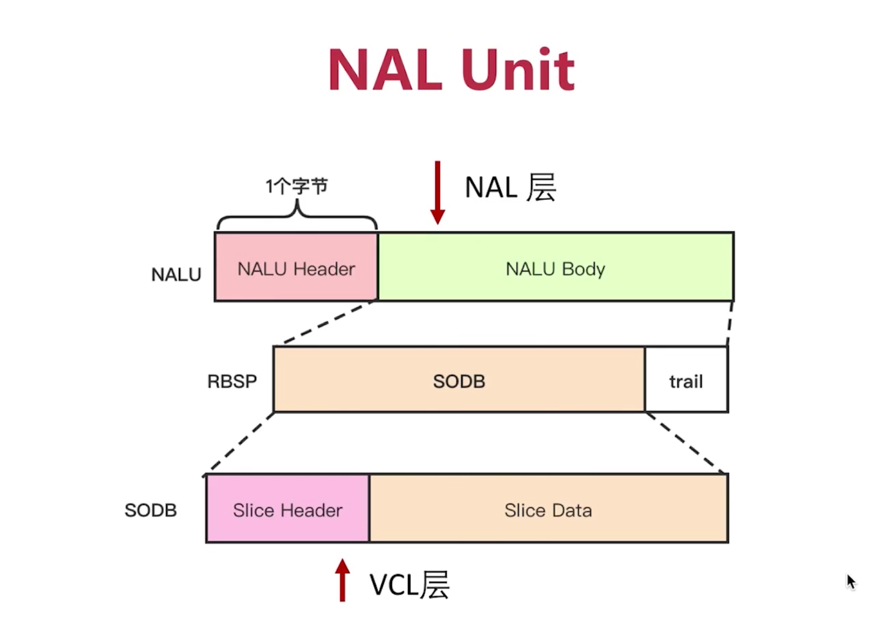

## 一、认识H264

### 1、H264的压缩比是多少？

- 约 1/100
- 比如格式为YUV420、分辨率为640x480、帧率为15的码流是 55296kbps

- 经过H264压缩后，实际码流约：500kbps

### 2、比如720p，如何确定它的最近码流大概是多少？

- 可以去 声网 这种比较权威的网站查询，这些都是经验值，没有标准值。
- https://docs.agora.io/cn

### 3、什么是GOP？一个GOP中可能存在多个I帧吗？

- GOP：Group Of Picture，图像组
- 在最新的H264标准中，一个GOP可以存在多个I帧。

#### 4、什么是I帧？什么是IDR帧？

- I帧，关键帧，采用帧内压缩技术，能独立解码出完整的一帧图片。
- IDR，解码器立即刷新帧，清空参考帧队列，防止帧错误蔓延。

- IDR帧是特殊的I帧
- 每个GOP中的第一帧就是IDR帧

### 5、什么是P帧？

- P帧，Forward Predicted Frame，向前参考帧，会参考前面的I帧或P帧。
- 采用帧间编码压缩技术。

### 6、什么是B帧？

- B帧，Bidirectionally predicted frame，双向参考帧。
- 会同时参考前面和后面的I帧或P帧。
- 采用帧间编码压缩技术。

## 二、H264压缩技术

### 1、H264压缩主要四大技术，分别目标是什么？

- 帧内压缩：解决的是空域数据冗余问题
- 帧间压缩：解决的是时域数据冗余问题
- DCT变化：整数离散余弦变换（DCT），将离散数据聚合，方便后续压缩
- CABAC压缩：熵编码，属于无损压缩

### 2、视频花屏和卡顿的原因是什么？

- 花屏：如果GOP分组中有帧丢失，会造成解码端的图像发生错误，这会出现马赛克(花屏)

- 卡顿：如果GOP解析错误，要等待下一个I帧到来，图像就静止了，这就出现的所谓的卡顿

### 三、H264码流分层

### 1、为什么要出现NAL层？

- NAL，Network Abstract Layer，视频数据网络抽象层
- 是为了解决网络传输过程中的丢包、乱序等问题

### 2、什么VCL层？

- VCL，Video Coding Layer，视频数据编码层
- 帧内编码、帧间编码、DCT变换、熵编码最后出来的数据，就是VCL层数据

### 3、VCL结构关系？（从帧、片、宏块、子块）

### 4、SODB、RBSP、NALU 之间是什么关系？

- SODB，String Of Data BIts，原始数据比特流，长度不一定是8的倍数，故需要补齐

- RBSP，Raw Byte Sequence Payload，是对SODB数据进行补齐后的字节流数据；RBSP = SODB + trailing bits
- NALU，Network Abstract Layer Unit，网络抽象层单元 = NAL header + RBSP

### 5、整个码流分层图（本节最重要的图，要能默写）

