## 一、认识SPS与PPS


### 1、认识SPS？主要包含哪些信息？

- SPS(Sequence Parameter Set)，序列参数集，作用于一串连续的视频图像。
- 比如：帧数、解码图像尺寸、参考帧数目


### 2、认识PPS？主要包含哪些信息？

- PPS(Picture Parameter Set)，图像参数集，作用于视频序列中的图像
- 比如：熵编码选择标识、片组数目


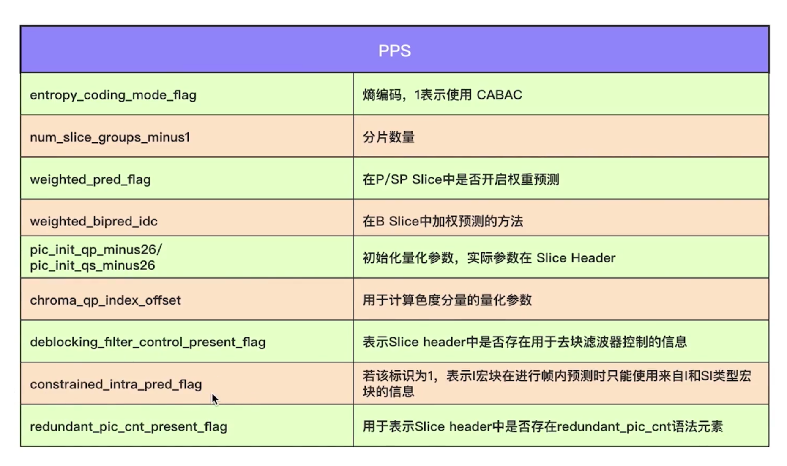


### 3、掌握Profile

- H264 Profile：对视频压缩特性的描述，Profile越高，说明采用了越高级的压缩特性


### 4、掌握H264 Level

- H264 Level：是对视频的描述，Level越高，视频的码率，分辨率越高


### 5、视频分析工具主流有哪些（说两个）？

- Evecard Stream Eye
- 雷神开发的工具


### 二、H264编码实战

### 1、基本步骤，主要四步

- 打开编码器
- 转换NV12到YUV420P
- 准备编码数据 AVFrame
- H264编码


### 2、口述下NV12转YUV420p的思路？

- NV12数据存放结构：YYYYYYYYYYUVUVUV
- YUV420p数据存放结构：YYYYYYYYYYUUUVVV
- <font color="red">从NV12中分别提取出Y、U、V数据，然后进行重新组合存放，即可。</font>

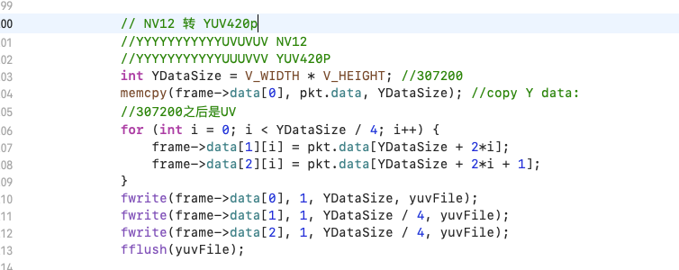


### 3、在进行NV12转YUV420p时，由于手误向文件中写入了两次数据，播放文件，会出现什么现象？


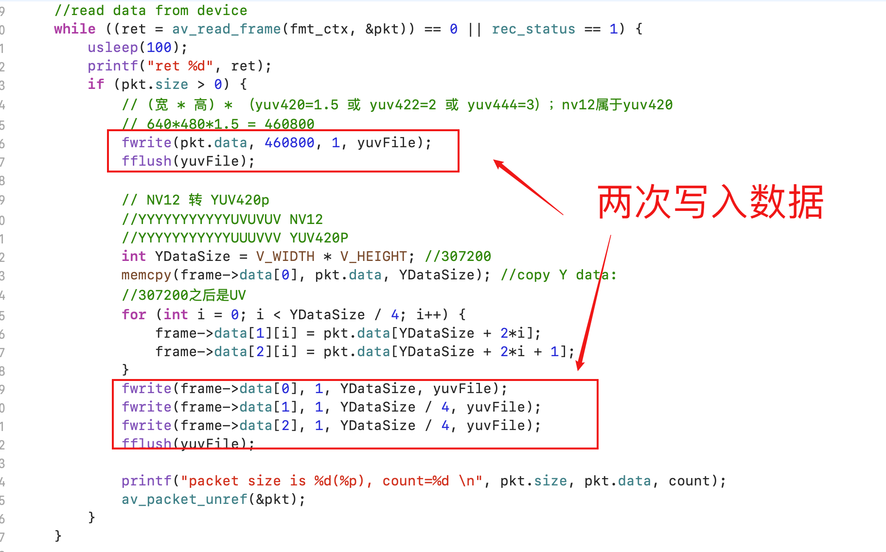


### 

- 第一次写入NV12数据
- 第二次写入YUV420p数据

```sh
ffplay -video_size 640x480 -pixel_format yuv420p -framerate 25 420p.yuv
```

- 以上指令播放时，会出现<font color="red">录屏动作被放缓了两倍，并且视频颜色闪烁</font>
- 原因：Y分量没问题，UV分量部分错位了，可以通过以下指令进行调试测试。

```sh
ffplay -video_size 640x480 -pixel_format yuv420p -framerate 25 -vf extractplanes='y' 420p.yuv
```

```sh
ffplay -video_size 640x480 -pixel_format yuv420p -framerate 25 -vf extractplanes='u' 420p.yuv
```

```
ffplay -video_size 640x480 -pixel_format yuv420p -framerate 25 -vf extractplanes='v' 420p.yuv
```

- 通过上面指令，就可以明显看到u、v分量的闪烁效果。而 y分量的缺只是播放速度减慢了。


### 4、在编码H264的时候，如果少了下面图中两个步骤，会产生什么效果？


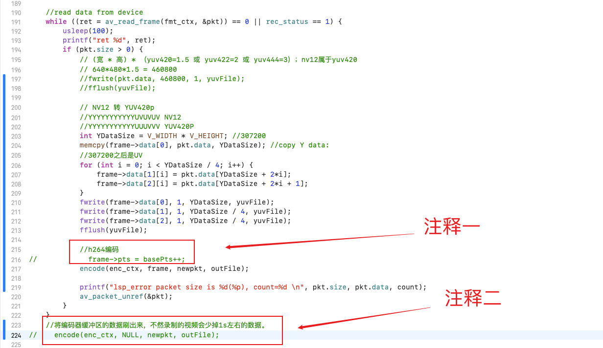


- 注释一：会导致pts混乱，最终播放的h264文件，会有马赛克。
- 注释二：会导致最终h264文件少掉几帧数据，不完整，因为压缩缓冲区的数据没被刷出来。


### 5、H264编码完整代码如下

```C
#include "test.h"
#include <unistd.h>
#include "include/libavutil/avutil.h"
#include "include/libavdevice/avdevice.h"
#include "include/libavcodec/avcodec.h"
#include "include/libswresample/swresample.h"

#include <string.h>

#define V_WIDTH 640
#define V_HEIGHT 480

static int rec_status = 1;

void set_status(int status){
    rec_status = status;
}

///打开编码器
static void open_encoder(int width, int height, AVCodecContext **enc_ctx) {
    int ret = 0;
    const AVCodec *codec = NULL;
    codec = avcodec_find_encoder_by_name("libx264");
    if (!codec) {
        printf("lsp_error avcodec_find_encoder_by_name error \n");
        exit(1);
    }
    *enc_ctx = avcodec_alloc_context3(codec);
    if (!enc_ctx) {
        printf("lsp_error avcodec_alloc_context3 error \n");
        exit(1);
    }
    
    //SPS、PPS
    (*enc_ctx)->profile = FF_PROFILE_H264_HIGH_444;
    (*enc_ctx)->level = 50; //表示Level是5.0
    
    //设置分辨率
    (*enc_ctx)->width = width;
    (*enc_ctx)->height = height;
    
    //GOP
    (*enc_ctx)->gop_size = 250;
    (*enc_ctx)->keyint_min = 25; //optional
    
    //设置B帧数据
    (*enc_ctx)->max_b_frames = 3; //optional
    (*enc_ctx)->has_b_frames = 1; //optional
    
    //参考帧的数量
    (*enc_ctx)->refs = 3; //optional
    (*enc_ctx)->pix_fmt = AV_PIX_FMT_YUV420P;
    
    //设置码率
    (*enc_ctx)->bit_rate = 600000; //600kbps
    
    //设置帧率
    (*enc_ctx)->time_base = (AVRational){1, 25}; //帧与帧直接的间隔是time_base
    (*enc_ctx)->framerate = (AVRational){25, 1}; //帧率，每秒 25 帧
    
    ret = avcodec_open2(*enc_ctx, codec, NULL);
    if (ret < 0) {
        printf("lsp_error avcodec_open2 error \n");
        exit(1);
    }
}

///创建AVFrame
static AVFrame* create_frame(int width, int height) {
    int ret = 0;
    AVFrame *frame = av_frame_alloc();
    if (!frame) {
        printf("lsp_error av_frame_alloc error \n");
        goto __ERROR;
    }
    
    //设置参数
    frame->width = width;
    frame->height = height;
    frame->format = AV_PIX_FMT_YUV420P;
    
    //alloc inner memory
    ret = av_frame_get_buffer(frame, 32); //按32位对其（TODO）
    if (ret < 0) {
        printf("lsp_error av_frame_get_buffer error \n");
        goto __ERROR;
    }
    return frame;
    
__ERROR:
    if (frame) {
        av_frame_free(&frame);
    }
    return NULL;
}

///h264编码
static void encode(AVCodecContext *enc_ctx, AVFrame *frame,AVPacket *newpkt,FILE *outfile) {
    int ret = 0;
    if (!enc_ctx || !newpkt || !outfile) { //参数检查
        printf("lsp_error encode 参数有误 \n");
        exit(1);
    }
    
    if (frame) {
        printf("send frame to encoder, pts=%lld \n", frame->pts);
    }
    
    ret = avcodec_send_frame(enc_ctx, frame);
    if (ret < 0) {
        char strErr[1024];
        av_strerror(ret, strErr, 1024);
        printf("lsp_error avcodec_send_frame error , %s \n", strErr);
        exit(1);
    }
    
    while (ret >= 0) {
        ret = avcodec_receive_packet(enc_ctx, newpkt);
        if (ret == AVERROR(EAGAIN) || ret == AVERROR_EOF) {
            return;
        } else if(ret < 0) {
            printf("lsp_error avcodec_receive_packet error \n");
            exit(1);
        }
        fwrite(newpkt->data, 1, newpkt->size, outfile);
        fflush(outfile);
    }
}

///录视频（主入口）
void record_video(void) {
    int ret = 0;
    char errors[1024];
    
    //ctx
    AVFormatContext *fmt_ctx = NULL;
    AVDictionary *options = NULL;
    AVCodecContext *enc_ctx = NULL;
    
    //packet
    int count = 0;
    AVPacket pkt;
    
    // [video device]:[aduio device]
    char *devicename = "0";
    
    //register audio device
    avdevice_register_all();
    
    //get format
    const AVInputFormat *iformat = av_find_input_format("avfoundation");
    
    av_dict_set(&options, "video_size", "640x480", 0);
    av_dict_set(&options, "framerate", "30", 0);
    av_dict_set(&options, "pixel_format", "nv12", 0);
    
    //打开编码器
    open_encoder(V_WIDTH, V_HEIGHT, &enc_ctx);
    
    //创建AVFrame、AVPacket
    AVFrame *frame = create_frame(V_WIDTH, V_HEIGHT);
    AVPacket *newpkt = av_packet_alloc();
    if (!newpkt) {
        printf("lsp_error av_packet_alloc");
    }
    int basePts = 1;
    
    //open device
    ret = avformat_open_input(&fmt_ctx, devicename, iformat, &options);
    if (ret < 0) {
        av_strerror(ret, errors, 1024);
        printf("lsp_error avformat_open_input error \n");
        return;
    }
    
    //crate file
    char *yuvPath = "/Users/carrot/Desktop/MyCode/420p.yuv";
    char *outPath = "/Users/carrot/Desktop/MyCode/420p.h264";
    FILE *yuvFile = fopen(yuvPath, "wb+");
    FILE *outFile = fopen(outPath, "wb+");
    if (yuvFile == NULL) {
        printf("lsp_error yuvFile fopen failed \n");
        return;
    }
    if (outPath == NULL) {
        printf("lsp_error outPath fopen failed \n");
        return;
    }
    
    //read data from device
    while ((ret = av_read_frame(fmt_ctx, &pkt)) == 0 || rec_status == 1) {
        usleep(100);
        printf("ret %d", ret);
        if (pkt.size > 0) {
            // (宽 * 高) * （yuv420=1.5 或 yuv422=2 或 yuv444=3）；nv12属于yuv420
            // 640*480*1.5 = 460800
            //fwrite(pkt.data, 460800, 1, yuvFile);
            //fflush(yuvFile);
            
            // NV12 转 YUV420p
            //YYYYYYYYYYYUVUVUV NV12
            //YYYYYYYYYYYUUUVVV YUV420P
            int YDataSize = V_WIDTH * V_HEIGHT; //307200
            memcpy(frame->data[0], pkt.data, YDataSize); //copy Y data:
            //307200之后是UV
            for (int i = 0; i < YDataSize / 4; i++) {
                frame->data[1][i] = pkt.data[YDataSize + 2*i];
                frame->data[2][i] = pkt.data[YDataSize + 2*i + 1];
            }
            fwrite(frame->data[0], 1, YDataSize, yuvFile);
            fwrite(frame->data[1], 1, YDataSize / 4, yuvFile);
            fwrite(frame->data[2], 1, YDataSize / 4, yuvFile);
            fflush(yuvFile);
            
            //h264编码
            frame->pts = basePts++;
            encode(enc_ctx, frame, newpkt, outFile);
            
            printf("lsp_error packet size is %d(%p), count=%d \n", pkt.size, pkt.data, count);
            av_packet_unref(&pkt);
        }
    }
    //将编码器缓冲区的数据刷出来，不然录制的视频会少掉1s左右的数据。
    encode(enc_ctx, NULL, newpkt, outFile);
    
    //close device and release ctx
    avformat_close_input(&fmt_ctx);
    
    printf("lsp_error 运行结束\n");
}

```


- 注意：如果没有调用 `avcodec_open2` 会导致 `avcodec_send_frame` 报错：<font color="red">[avcodec_send_frame returns "invalid argument"](https://stackoverflow.com/questions/69643784/avcodec-send-frame-returns-invalid-argument)</font>


## 三、x264参数详解、参考资料（暂时不看吧，只做记录）

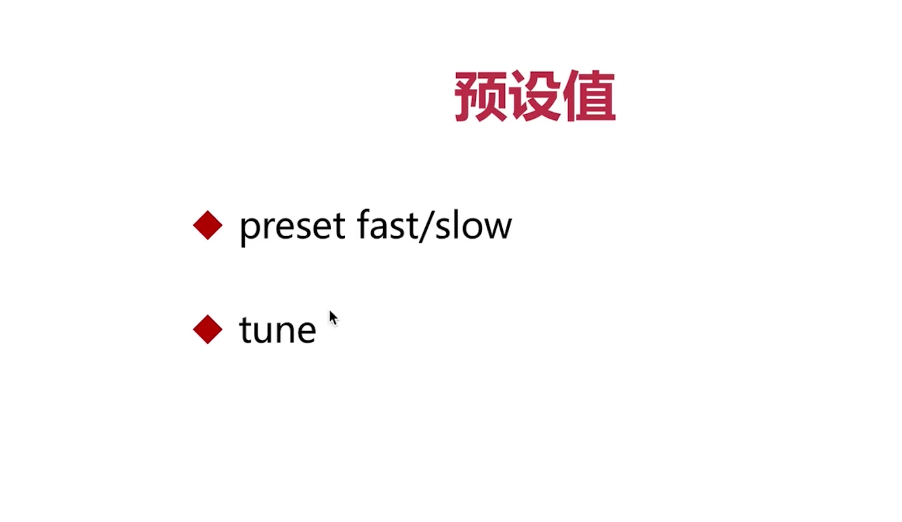

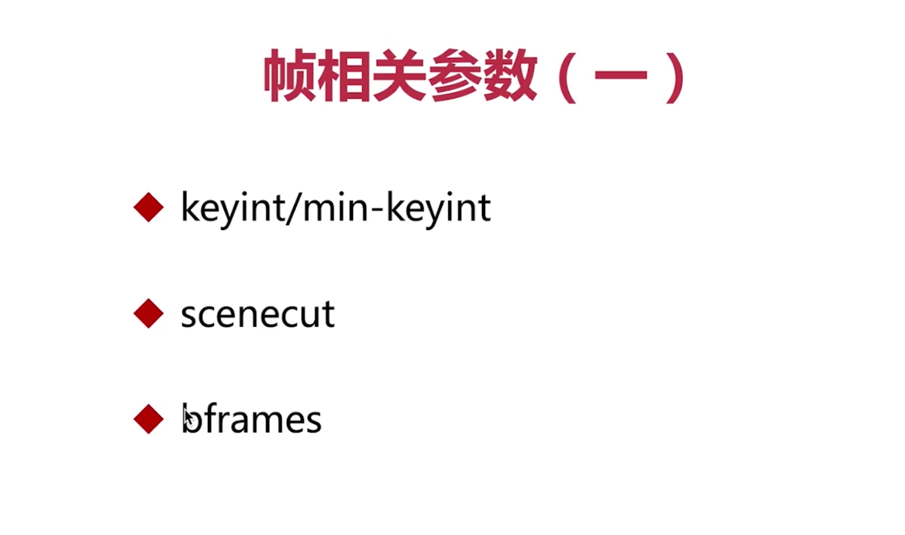

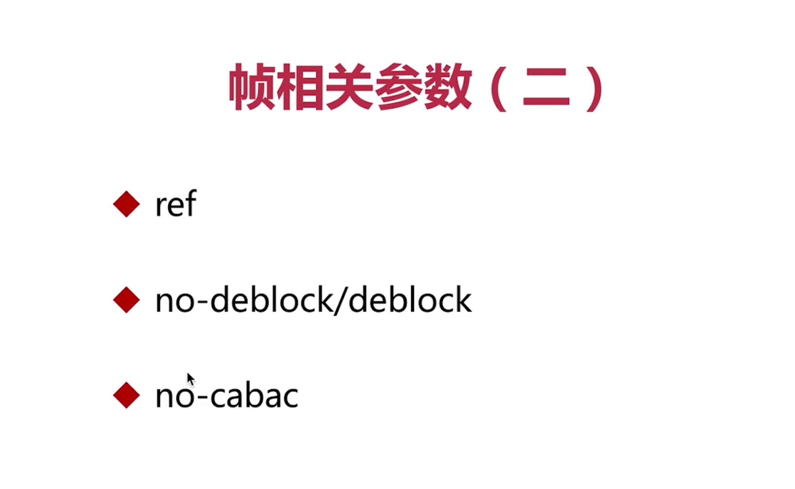

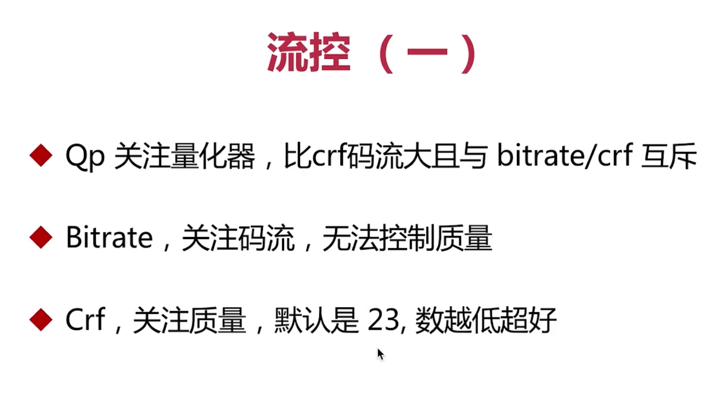

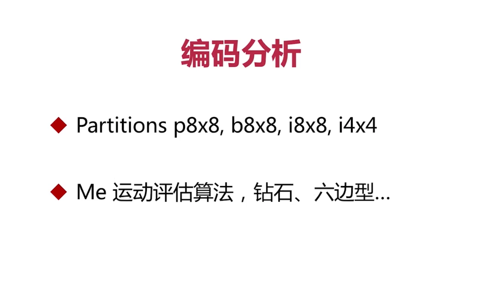

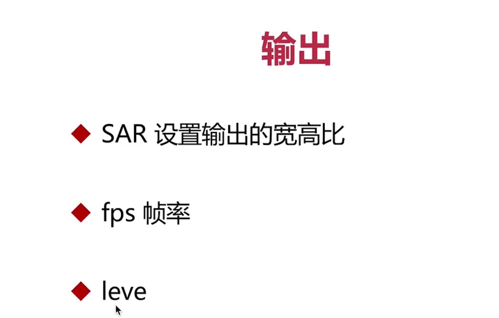

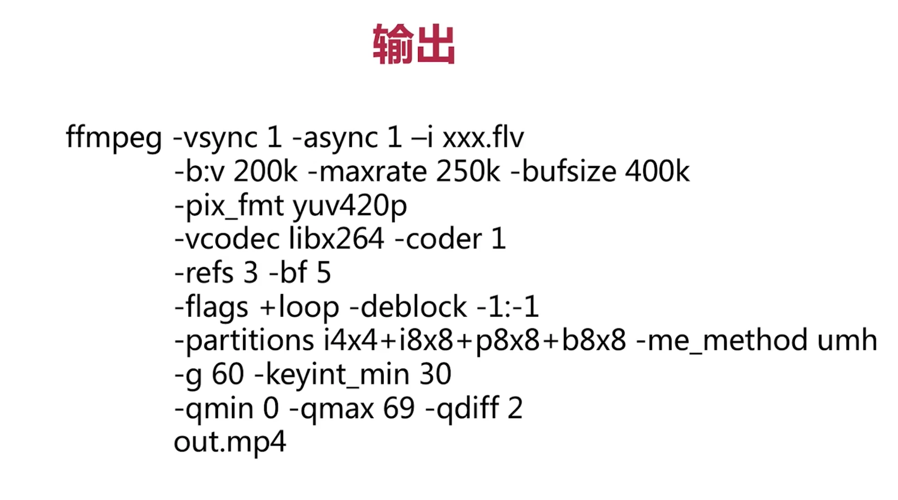


