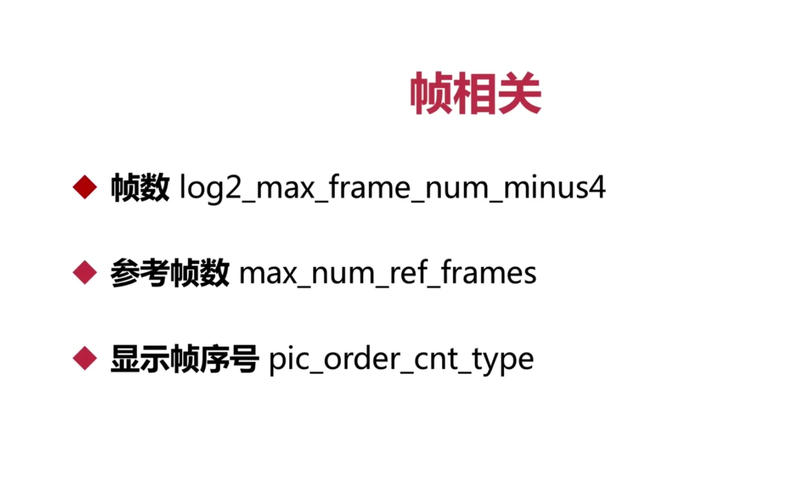
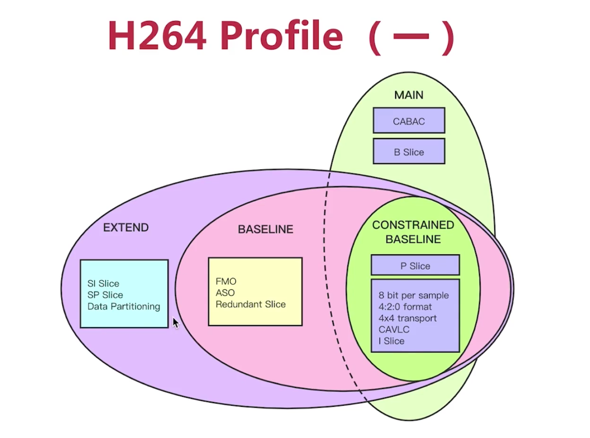
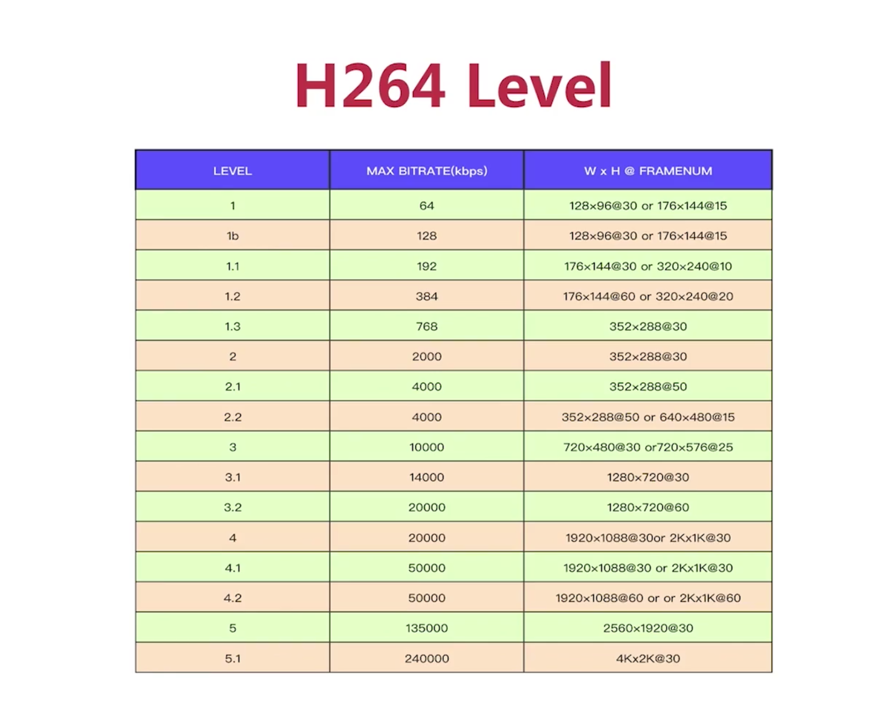

## 一、认识SPS与PPS

### 1、认识SPS？主要包含哪些信息？

- SPS(Sequence Parameter Set)，序列参数集，作用于一串连续的视频图像。
- 比如：帧数、解码图像尺寸、参考帧数目

### 2、认识PPS？主要包含哪些信息？

- PPS(Picture Parameter Set)，图像参数集，作用于视频序列中的图像
- 比如：熵编码选择标识、片组数目

### 3、掌握Profile

- H264 Profile：对视频压缩特性的描述，Profile越高，说明采用了越高级的压缩特性

### 4、掌握H264 Level

- H264 Level：是对视频的描述，Level越高，视频的码率，分辨率越高

### 5、视频分析工具主流有哪些（说两个）？

- Evecard Stream Eye
- 雷神开发的工具

### 二、H264编码实战

### 1、基本步骤，主要四步

- 打开编码器
- 转换NV12到YUV420P
- 准备编码数据 AVFrame
- H264编码

