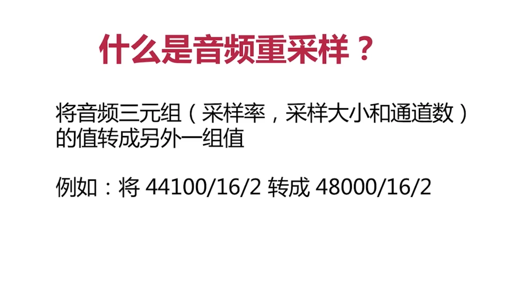

## 一、音频重采样

### 1、什么是音频重采样？




### 2、什么情况下需要进行音频重采样？

- 情况一：从设备采集的音频数据与编码器要求的数据不一致
- 情况二：播放器要求的音频数据与要播放的音频数据不一致
- 情况三：要方便某些运算的时候


### 3、简述音频重采样主要三个步骤？

- 设置重采样参数，并初始化重采样上下文。

```C
    swr_ctx = swr_alloc_set_opts(NULL,
                                 AV_CH_LAYOUT_STEREO, AV_SAMPLE_FMT_S16, 44100,  // 重采样输出音频三要素
                                 AV_CH_LAYOUT_STEREO, AV_SAMPLE_FMT_FLT, 44100,  // 重采样输入音频三要数
                                 0, NULL);
    ret = swr_init(swr_ctx);
```

- 设置重采样的输入和输出数据存放区

```C
    uint8_t **src_data = NULL;
    int src_linesize = 0;
    uint8_t **dst_data = NULL;
    int dst_linesize = 0;
    
    av_samples_alloc_array_and_samples(&src_data, &src_linesize, 2, 512, AV_SAMPLE_FMT_FLT, 0);
    av_samples_alloc_array_and_samples(&dst_data, &dst_linesize, 2, 512, AV_SAMPLE_FMT_S16, 0);
```

- 进行重采样

```C
            // 进行内存拷贝
            memcpy((void*)src_data[0], (void*)pkt.data, pkt.size);
            
            // 重采样
            swr_convert(swr_ctx,                    //重采样的上下文
                        dst_data,                   //输出结果缓冲区
                        512,                        //输出单个通道的采样数
                        (const uint8_t **)src_data, //输入缓冲区
                        512);                       //输入单个通道的采样数
            
            
            fwrite(dst_data[0], 1, dst_linesize, outFile);
            fflush(outFile);
```

### 4、音频重采样完整代码如下

```C
#include "test.h"
#include <unistd.h>
#include "include/libavutil/avutil.h"
#include "include/libavdevice/avdevice.h"
#include "include/libavcodec/avcodec.h"
#include "include/libswresample/swresample.h"

//录音
void record_audio(void) {
    int ret = 0;
    char errors[1024];
    
    //ctx
    AVFormatContext *fmt_ctx = NULL;
    AVDictionary *options = NULL;
    SwrContext *swr_ctx = NULL;
    
    swr_ctx = swr_alloc_set_opts(NULL,
                                 AV_CH_LAYOUT_STEREO, AV_SAMPLE_FMT_S16, 44100,  // 重采样输出音频三要素
                                 AV_CH_LAYOUT_STEREO, AV_SAMPLE_FMT_FLT, 44100,  // 重采样输入音频三要数
                                 0, NULL);
    if (swr_ctx == NULL) {
        printf("swr_alloc_set_opts error");
        return;
    }
    
    ret = swr_init(swr_ctx);
    if (ret != 0) {
        printf("swr_init error");
        return;
    }
    
    uint8_t **src_data = NULL;
    int src_linesize = 0;
    uint8_t **dst_data = NULL;
    int dst_linesize = 0;
    
    av_samples_alloc_array_and_samples(&src_data, &src_linesize, 2, 512, AV_SAMPLE_FMT_FLT, 0);
    av_samples_alloc_array_and_samples(&dst_data, &dst_linesize, 2, 512, AV_SAMPLE_FMT_S16, 0);
    
    //packet
    int count = 0;
    AVPacket pkt;
    
    // [video device]:[aduio device]
    char *devicename = ":0";
    
    //register audio device
    avdevice_register_all();
    
    //get format
    const AVInputFormat *iformat = av_find_input_format("avfoundation");
    
    //open device
    ret = avformat_open_input(&fmt_ctx, devicename, iformat, &options);
    if (ret < 0) {
        av_strerror(ret, errors, 1024);
        printf("avformat_open_input error");
        return;
    }
    
    //crate file
    char *outPath = "/Users/carrot/Desktop/MyCode/swr_audio.pcm";
    FILE *outFile = fopen(outPath, "wb+");
    if (outFile == NULL) {
        printf("outFile fopen failed");
        return;
    }
    
    //read data from device
    while ((ret = av_read_frame(fmt_ctx, &pkt)) == 0 || count++ < 50000) {
        usleep(100);
        printf("ret %d", ret);
        if (pkt.size > 0) {
            //进行内存拷贝
            memcpy(src_data[0], pkt.data, pkt.size);
            
            //重采样
            swr_convert(swr_ctx, dst_data, 512, (const uint8_t **)src_data, 512);
            
            fwrite(dst_data[0], dst_linesize, 1, outFile);
            fflush(outFile);
            printf("packet size is %d(%p), count=%d \n", pkt.size, pkt.data, count);
            av_packet_unref(&pkt);
        }
    }
    
    //close device and release ctx
    avformat_close_input(&fmt_ctx);
    
    printf("运行结束\n");
}
```


### 5、借助ffplay播放重采样的数据

```SH
ffplay -ar 44100 -f s16le -ac 2 swr_audio.pcm 
```


